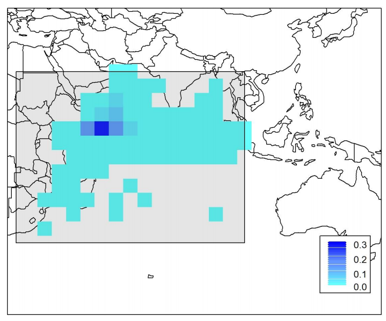
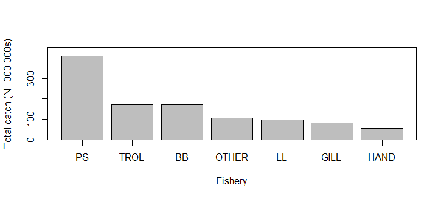
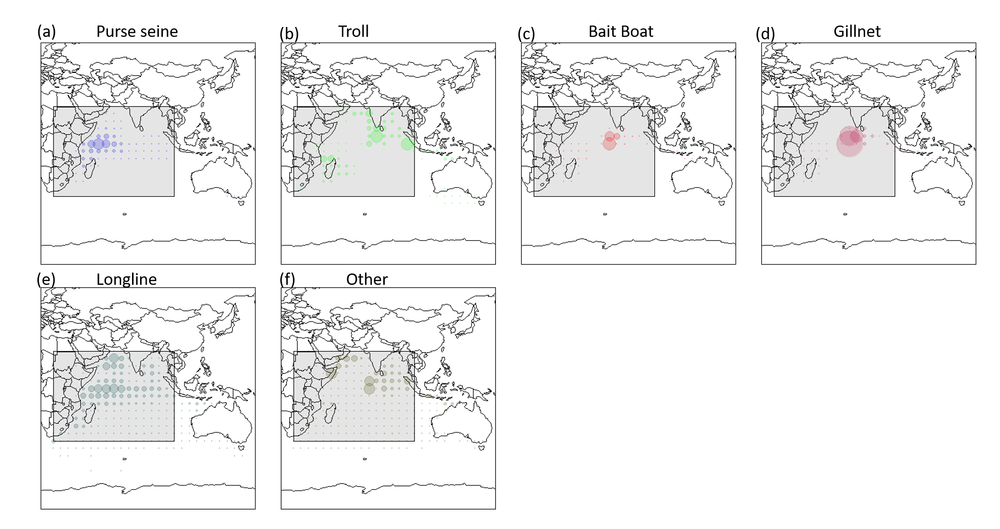

```{r, include = FALSE}
knitr::opts_chunk$set(
  collapse = TRUE,
  comment = "#>",
  options(rmarkdown.html_vignette.check_title = FALSE)
)
```
```{r setup}
library(SpatialAssessmentModelingWorkshop)
```
# 1. Overview
In this document, we provide a general description of the yellowfin tuna (*Thunnus albacares*) case study and associated operating model (OM) used for the simulation experiment. This document will help simulation experiment participants develop and apply both spatially stratified and spatially aggregated stock assessments using their chosen modeling platform. The following description provides an overview of the primary assumptions and main components of the YFT operating model, including spatial configuration, population dynamics, simulated data, and model stochasticity. 

Recent YFT stock assessments performed for the Indian Ocean Tuna Commission (IOTC), as well as supplementary papers that describe the operating model (i.e., the simulation model) in more detail are also provided on the Spatial Stock Assessment Workshop [GitHub repository](https://github.com/aaronmberger-nwfsc/Spatial-Assessment-Modeling-Workshop/). While the recent operational YFT stock assessment is provided as general background ([Fu et al., (2018), Cardinale et al. (2020)](https://github.com/aaronmberger-nwfsc/Spatial-Assessment-Modeling-Workshop/blob/main/docs/articles/Relevant_literature_files/Fu%20et%20al.%20(2018)%20IOTC-2018-WPTT20-33.pdf/)), this simulation experiment is strictly a research endeavor, with the Indian Ocean YFT stock chosen as an example to address broad study objectives. Analysts should be aware that the reality simulated by the YFT OM differs substantially in some respects from the real IO-YFT population. 

The Indian Ocean YFT operating model developed for this simulation experiment is described below.  It is based on a previous version described in detail in [Dunn et al. (2020)](https://github.com/aaronmberger-nwfsc/Spatial-Assessment-Modeling-Workshop/blob/main/docs/articles/Relevant_literature_files/Dunn%2C%20Hoyle%2C%20Datta%202020%20v1%20SPM%20YFT%20OM.pdf), but with key differences. Specifically, it incorporates time-varying spatial recruitment apportionment layers, a longer time series of stochastic recruitment deviations, and fixes an issue with the previously used growth curve. 

# 2.	Architecture of the YFT OM and prior model conditioning
Using the Spatial Population Model software (SPM, developed by A. Dunn, S. Rasmussen, and S. Mormede, available [here](https://github.com/alistairdunn1/SPM)), a spatially explicit population dynamics OM was developed for YFT, a highly migratory pelagic species, in the Indian Ocean. This model was conditioned using empirical data from region-specific fisheries and spatially explicit (disaggregated) catch, longline CPUE, tag recapture data, and length frequencies at a 5x5$^\circ$ grid cell resolution (221 total cells). The OM was conditioned by fitting the disaggregated IOTC data within SPM itself using maximum likelihood to estimate fishery and population parameter values (e.g., fishery selectivity, fishing mortality, recruitment, and movement; see [Dunn et al. (2020)](https://github.com/aaronmberger-nwfsc/Spatial-Assessment-Modeling-Workshop/blob/main/docs/articles/Relevant_literature_files/Dunn%2C%20Hoyle%2C%20Datta%202020%20v1%20SPM%20YFT%20OM.pdf) for further details). R~0~, recruitment deviations and recruitment apportionment were fixed based on values described in a recent stock assessment conducted by Fu et al. (2018). The conditioned YFT SPM model was then used as an operating model to simulate pseudo-data with observation error, such that these *simulated observations* provide plausible values for Indian Ocean YFT. Each 5x5$^\circ$ grid cell within the spatial domain of the SPM OM is treated as a unique population sub-unit with local recruitment, mortality, and movement dynamics.  

As a check on the simulated dynamics and associated data from the YFT SPM OM, an integrated assessment model (Stock Synthesis 3, SS3) was fit to the 4 area aggregated data from a subset of the simulated datasets. The SS3 model, though not optimized, was able to fit the pseudo-data without any major diagnostic or convergence issues. The estimated population trajectories adequately reflected the true values from the SPM OM. Thus, the organizers have verified that the OM is producing reliable outputs that should be interpretable by any flexible integrated assessment platform.

The general process of OM development and OM conditioning was as follows:

i.	The YFT OM was built in SPM based on fits to the empirical IOTC fishery dependent datasets. SPM was conditioned by running SPM in estimation mode, to estimate population parameters (e.g., fishery selectivity, catchability, fishing mortality) based on empirical YFT catch, CPUE, tagging, and length frequency data along with some assumptions (based on previous assessments for this species and region).
ii.	The conditioned YFT OM defines the base population dynamics for the experiment. 
iii. The OM was then run in simulation mode to generate simulated data with observation error and recruitment process error/stochasticity.
iv.	Pseudo-data were then aggregated to 4 regions (current configuration in the operational assessment used for management) and 1 region (panmictic) for the purpose of developing and testing stock assessment models. 
v. To validate the simulation process, SS3 was successfully applied to a simulated dataset. Organizers have validated that the YFT SPM OM simulated data can be adequately fit within a 4 area SS3 estimation model (i.e., model converged and spawning stock biomass trends aligned with the OM reality).

One hundred realizations of the OM (i.e., each with different observation error and recruitment process error/stochasticity per run) were generated (100 are provided initially, more can be requested by participants).

# 3.	YFT OM build for the spatial simulation experiment 
The previous version of the YFT OM ([Dunn et al. (2020)](https://github.com/aaronmberger-nwfsc/Spatial-Assessment-Modeling-Workshop/blob/main/docs/articles/Relevant_literature_files/Dunn%2C%20Hoyle%2C%20Datta%202020%20v1%20SPM%20YFT%20OM.pdf) did not include stochasticity in recruitment. We introduced stochasticity into the YFT OM used in this simulation experiment by introducing process error in recruitment across space (spatial apportionment) and time (year class strength; YCS). Thus, simulated observations were generated for 100 different realizations of the OM, integrating both process and observation sources of error. 

We include only one OM scenario in this simulation experiment (which is based on realized fishery and biological data from the Indian Ocean), however we acknowledge that others could be used. A single OM scenario was chosen given the limitations of a worldwide simulation experiment and for ease of comparisons. The 100 different realizations of simulated data output from the experiment\'s YFT OM (including stochastic recruitment processes and observation error) encapsulate key sources of variability, allowing for an explicit evaluation of uncertainty in resultant estimation models.

## 3.1	Spatial & temporal operating model dimensions
Based on the domain assumed in the IOTC YFT operational assessment (Fig. 1a), a rectangular 13x17 grid of 5x5$^\circ$ cells (221 total), spanning 20$^\circ$E to 105$^\circ$E and 20$^\circ$N to 40$^\circ$S, demarcates the Indian Ocean into a planar Cartesian coordinate system. Of these, the 159 oceanic cells represent the spatial domain of the OM (Fig. 1b). No catch, CPUE or recruitment are attributed to cells fully on land. The temporal resolution in the OM is quarterly (referred to as a *pseudo-year*). The time series spans from pseudo-year 1 (first quarter of 1952) to pseudo-year 256 (fourth quarter of 2015). YFT ages are modeled from 0.25 age until 7 years of age (28 quarters or pseudo-years), where age 28 is a plus group. The quarterly ageing process moves fish between age classes.


  
***Fig. 1) a) Assessment regions defined from Fu et al. (2018); b) Grid cells for which SPM simulated YFT population and fishery dynamics. Note: Regions 1a (R1a) and 1b (R1b) are combined to form Region 1 in the 4-area model aggregation following Fu et al. (2018).***

## 3.2	Biological Processes

### 3.2.1	Population structure and processes
The YFT stock in the Indian Ocean was assumed to comprise a single interbreeding population with no interchange outside the modeled region. Therefore, the OM assumes a single population with a single stock-recruit function (i.e., recruitment is based on the total spawning stock biomass (SSB) existing throughout the model domain) with each cell representing a *patch* or *sub-population* unit within the domain-wide population. Although each cell undergoes unique mortality and movement processes, biological parameters (i.e., maturity, growth, and natural mortality) are constant across all cells. Cell-specific recruitment differs based on the spatial apportionment value for that cell in a given time step.

The order of population processes matches those assumed in the recent YFT stock assessment (Fu et al. (2018)). Within each model time step (pseudo-year), three population processes occur in the following chronological order: 

a. Recruitment occurs (at age 0.25), then tagging occurs (if present in the given pseudo-year), and then movement takes place; 
b. Fishing occurs and catch is removed from each cell, then data observations are made; 
c.  Other biological processes, including natural mortality, maturation, growth, and ageing, occur (see Table 1 and Fig. 3 for parameter inputs).

The OM assumes an initial equilibrium starting state (B~0~) with R~0~=97.2506 * 10^6^ individuals (i.e., the value of initial recruitment reported by Fu et al. (2018)) with initial age structure based on exponential decay due to natural mortality alone.

### 3.2.2	Length, age, and growth
The OM is a fully age-structured model, with ages from 0.25 to 7+ years (1 to 28+ pseudo-years), with the oldest age class modeled as a plus group.  

Although population demographics are being tracked by age class, the distribution of length at age is used to generate length frequency observations. Age composition data are not widely available for YFT fisheries. The OM specifies a population-wide mean size-at-age based on external estimates of YFT growth (Fu et al. (2018) based on Fonteneau & Gascuel (2008)) according to a von Bertalanffy growth function with age-dependent growth rate coefficient (k) deviates (Fig 3a).  Growth rate coefficient deviates apply to a subset of ages (Table A1) and are independent and additive relative to a base coefficient.
$$
L_{t+1,a} = L_{t,a} + (L_{t,a-k_{a}} - L_{inf}) (e^{-k_{a}-1}) \tag{Eq. 1}
$$
Weight-at-age is included in the YFT SPM OM based on a length-weight relationship: W = a*Length^b^. See Table 1 & A1 for parameter values.

### 3.2.3 Maturity and natural mortality
A maturation process moves individuals from an *immature* to a *mature* state based on age-specific maturity. Maturity is defined as an age-specific ogive with 50% maturity at age 9 (psuedo-years) (Fig. 3c). 
Natural mortality (M) is age-specific (Fig. 3d), and assumed to be constant through time and space. See Appendix Table A1 for the full maturity-, natural mortality-, and length-at-age vectors.

***Table 1. Biological parameters used by the SPM OM for YFT.***

| Parameter   |      Value      |
|:----------|:-------------:|
| R~0~ |  97.2506x10^6^ |
|  L~inf~ |    145 cm   |
| L~min~ | 22 cm |
| k (base) | 0.455 |
| Length of weight: a | 2.459e^-5^ |
| Length of weight: b | 2.9667 |


***Fig. 2). Biological parameters used in the YFT OM. a) von Bertalanffy age-length relationship, b) length-weight relationship, c) Proportion mature by age, d) natural mortality (M) by age.***

### 3.2.4 Recruitment
Recruitment into the population occurs at age 0.25 (i.e. pseudo-year 1), and recruitment events take place every quarter with spatial apportionment among grid cells. The OM assumes a global, population level Beverton-Holt spawner-recruitment relationship (SRR) based on the domain-wide total SSB and pseudo-year recruitment deviations referred to as pseudo-year class strength multipliers (YCS).  Steepness of the Beverton-Holt SRR is 0.8, and R~0~=97.2506 * 10^6^ individuals (based on the 2018 YFT stock assessment estimates). The base YCS values for each pseudo-year were determined during the conditioning stage, and subsequently stochasticity in YCS was included for each pseudo-year across the 100 simulated data sets (see section 3.5). The mean spatial apportionment of recruitment among grid cells is based on the observed distribution of small (<40cm) YFT caught in the purse seine fishery (Fig 3). 



***Fig. 3) Base layer (i.e., without stochasticity) of spatial apportionment of recruitment of age 1 YFT. Light blue to dark blue coloration represents low to high recruitment apportionment occurring in each cell. The base layer apportionment is based on the abundance of fish that were less than 40cm in length caught by the purse-seine fishery (Figure from Dunn et al., (2020)).***

## 3.5 Movement
Movement across the spatial domain is simulated using spatiotemporal habitat-based preference functions, which are probability functions defining attraction to a given cell based on spatial attributes, with parameters estimated during model conditioning. Movement in the OM is based on functions of sea surface temperature, chlorophyll-a, and the Euclidian distance between cell centroids. Temperature and chlorophyll-a were specified at each time step and cell based on environmental and oceanographic layers. Using the joint probability function describing the combined preference, the proportion of the population moving from cell *a* to any cell *b* is defined as a ratio of the preference of being in cell *b* to the sum of the preference in all the cells (Dunn et al. (2015)). Movement is specified independently for each maturity category (immature or mature), but fish within a maturity category responded in the same way to the oceanographic layers or distance regardless of age or whether they were tagged or untagged. 

## 3.3 Fishery dynamics
Fishing is applied using an exploitation rate (removals/abundance) equation, rather than an approximation to the Baranov equation, to allow removal of the observed catch (i.e., no observation error in catch is included) by cell directly. The maximum exploitation rates (*U~max~*) were set equal to 0.95 in each of the time steps, model pseudo-years, and spatial cells where fishing occurred. The cell specific (*c*) exploitation rate, *U*, is given by: 

<!-- $$ -->
<!--   U_f,_c = C_f,_c/\sum _a \bar{w_a}S_{f,a}n_a,_c \tag{Eq. 2} -->
<!-- $$ -->

$$
  U_f,_c = C_f,_c/\sum _a S_{f,a}n_a,_c \tag{Eq. 2}
$$

<!-- *w~a~* is the mean weight of a fish at age *a*, -->
 
where *C~f~* denotes the catch from fishery *f*, *S~f~* is the selectivity for fishery *f* at age *a*, and *n~a~* is the pre-mortality number of fish at age *a*. Catches were modelled using the empirical observed number of fish caught, which is an assumed known without error. 

The operating model included a total of 7 fisheries defined by gear type (reduced from 25 fisheries in Fu et al., (2018)). These included Purse Seine (*PS*), troll (*TROL*), bait boat (*BB*), gillnet (*GILL*), longline (*LL*), handline (*HAND*), and all other fisheries categorized as *OTHER*. Catch (Figs. 4-6) and length frequencies were simulated for each gear type in all cells where a given fishery was assumed to occur. Note that not all fisheries operate in all model time steps. Selectivity is specific to each gear type and is constant through time and across space. See Table 3 for the functional forms of selectivity. Length frequencies (LFs) for each fishery were simulated for periods with simulated catch. Lengths were grouped into 5cm bins between 10 and 195+ cm, with lengths less than 10cm aggregated into a minus group bin, and fish >195cm aggregated into a plus group bin (195-200 cm). Length frequencies were simulated for each of the seven fisheries for each pseudo-year and spatial cell where fishing occurred (Table 4). 

***Table 3) Selectivity for the 7 fisheries included in the YFT OM.***

| Fishery | Selectivity form |
|:----------|:-------------:|
| Purse Seine | Double normal |
| Troll | Double normal |
| Bait Boat | Double normal |
| Gillnet | Double normal |
| Longline | Logistic |
| Handline | Double normal |
| Other | Double normal |

CPUE is simulated for the longline fishery between pseudo-years 81-256 as an index of relative abundance. Catchability of the longline CPUE is constant across space and through time, with no seasonal variation. The unstandardized CPUE is calculated as the number of fish caught by the longline fishery divided by the number of hooks in each cell (as such units for each CPUE index are in N/hooks). CPUE output from SPM is at the cell scale (159 cells with CPUE data) and not standardized as in 4 area and 1 area aggregations (described in Sections 4 and 5). 

***Table 4). Observation error distribution type as well as start and end pseudo-year for length frequencies.***

| Fishery | Begin (pseudo-year) | End (pseudo-year) | Simulation likelihood |
|:----------|:-------------:|:----------:|:-------------:|
|Purse seine | 121 | 256 | Multinomial |
| Troll | 134 | 255 | Multinomial |
| Bait Boat | 126 | 256 | Multinomial |
| Gillnet | 93 | 232 | Multinomial |
| Longline | 9 | 238 | Multinomial |
| Handline | 205 | 256 | Multinomial |
| Other | 135 | 256 | Multinomial |



***Fig. 4) Aggregated (summed across cell and pseudo-year) catch (in numbers) from each of the 7 fisheries included in the YFT SPM OM.***


***Fig. 5) Total catch of yellowfin tuna by model pseudo-year in numbers (black, left hand y axis) and metric tons (red, right hand y axis).***



***Fig. 6) Total catch by cell for the seven fisheries included in the OM. Bubble size is scaled to fleet specific catch. ***

## 3.4 Tagging dynamics
Tagging is applied using the same methods as Fu et al. (2018) and with the assumed age of release determined by the size-at-age from the growth curve and the measured length at release (from the real-world tagging data). An equal number (54,688) of fish were tagged in our OM as were tagged in reality by the RTTP-IO program. As in the real-world tagging data, most of the releases occurred in the second and third quarter of 2006 (IOTC 2008) in region 1, with tag recoveries occurring until 2015. Tags were on average recaptured 2000-3000 km from their release location (Fig. 7c) and within 2-3 years from the time of release.

Tagging is implemented in categories (immature and mature) for each model pseudo-year where there were releases. Tagged fish were assigned to immature or mature in proportion to the ratios of immature or mature fish in the population at the time of release based on a binomial probability distribution. Tag releases occured in sub-time step (a) (see Section 3.2.1) in a given model pseudo-year and the cell that they were reported as released (from the real world tagging data). Tagged fish from each pseudo-year and cell were aggregated into either the immature or mature tag category; hence, a tag release cohort is defined by the pseudo-year, age, and maturity stage of release (but due to computational limitations, release cell was not tracked for the purpose of cohort tracking in this simulation). 

Tag recapture observations were simulated for each model pseudo-year and cell following release until the terminal model pseudo-year. Recaptures were recorded by release cohort (which does not include release cell), pseudo-year of recovery, age at recapture, and cell of recapture. For recaptures, a plus group was implemented at pseudo-year age 20, which helped reduce computation time.

Aside from initial mortality (i.e., the assumed proportion of fish that either lost their tags or died during the tagging process) and ongoing tag loss (i.e., an assumed rate that fish lost tags over time and were no longer identifiable as tagged fish), the population and movement processes applied to tagged fish were the same as the general population. Initial tag retention and survival is assumed to be 0.9 (i.e., 10% of fish with tags were assumed to have either lost their tag immediately or died as a result of the tagging process, or otherwise were not identifiable as tagged fish in the population), and implemented as a fixed process by discounting the numbers of released fish in each cohort by 10%. Ongoing tag loss rates were assumed to be 20% per 2000 days (Fu et al. (2018)), and is implemented as a model pseudo-year (i.e. quarterly) mortality of 0.91%. Age of recaptured fish is set equal to the age of that individual at release plus its time at liberty. Tag recaptures were reported solely by the purse seine fishery, equivalent to 90% reporting rate. Tag detection in other fisheries is not considered (i.e. only the purse seine fleet is assumed to report tags and reporting rates for other fisheries are set to 0%).


***Fig. 7) Movement of tagged yellowfin tuna in the Indian Ocean; a) spatially binned release locations, b) spatially binned recapture locations, c) distance moved by each fish between release and recapture locations. Warmer colors reflect highest releases and recaptures in subpanels (a) and (b).***

## 3.5	Stochasticity and observation error

### 3.5.1 Stochasticity in recruitment
The simulation model was run 100 times to encapsulate variation and provide 100 unique pseudo-data sets (more may be requested). The only population process that included stochasticity is recruitment, which included random pseudo-year deviations in YCS and pseudo-year deviations in spatial apportionment. 

For each of the 100 simulation runs, the YCS multipliers varied as a log-normally distributed stochastic process with a mean equal to 1 with a standard deviation of 0.6. YCS multipliers were included across all model pseudo-years, 1 - 256.

To introduce stochasticity (process error) into spatial recruitment apportionment within the OM, spatially correlated Gaussian random fields were generated for each of the 100 simulation runs. We used an exponential variogram model (from the *gstat* package in R (Pebesma,(2004)), which assumed a constant trend, with the partial sill = 0.025, range = 2, beta = 1 and the number of nearest observations used for the kriging prediction = 20. We then took the product of each of the random layers (100 simulations runs x 256 pseudo-years per run) and the original base layer (Fig. 2, the proportion of samples per grid cell that had fish <40cm in length from [Dunn et al. (2020)](https://github.com/aaronmberger-nwfsc/Spatial-Assessment-Modeling-Workshop/blob/main/docs/articles/Relevant_literature_files/Dunn%2C%20Hoyle%2C%20Datta%202020%20v1%20SPM%20YFT%20OM.pdf) and divided by the grid total (total recruitment apportionment for each spatial grid summed to 1) to attain random spatial recruitment proportions weighted by the original base recruitment values (see Fig. 8 for an example). Spatiotemporal recruitment stochasticity is thus introduced by multiplying YCS vectors with spatial apportionment matrices across each of the 256 pseudo-years in each of the 100 simulation runs. 


***Fig. 8) Heatmap of one realization of the spatial variability in recruitment apportionment constructed with correlated random fields weighted by the recruitment apportionment assumed in the base layer (Fig. 2). Warmer colors reflect higher apportionment.***

### 3.5.2	Observation error

#### 3.5.2.1	Catch
No observation error is assumed for catch data in the operating model. 

#### 3.5.2.2	CPUE
CPUE is simulated with observation error assuming a cell-specific CV of 0.2 and a lognormal distribution.

#### 3.5.2.3	Length Frequencies
Length frequencies were sampled from a multinomial likelihood parameterized by the effective sample size, N, which is set to 5 for all fisheries, cells, and pseudo-years.

#### 3.5.2.4	Tag recaptures
Recaptures were simulated in the purse seine fishery only, with a binomial likelihood to represent recaptures-at-length and an effective sample size equal to the number of fish scanned. Tag recapture observations were simulated by pseudo-year, where the number of tagged fish in a specific pseudo-year were binned by their recapture year for each year of release.

***Table 5). Observation error assumptions used to simulate each data source (i.e., catch, CPUE, length frequencies and tag recaptures).***

|  | Catch | CPUE | Length Frequencies | Tag recaptures |
|:----------|:-------------:|:----------:|:-------------:|:-------------: |
|Probability Distribution| No Error | Log-normal | Multinomial | Binomial |
| Observation error | (None)  | CV = 0.2 | ESS = 5 (per cell) | Sample size = 10840 individual fish scanned per cell, on average |

# 4.	Data aggregation: Four areas
Two different data aggregations were undertaken (i.e., 4 area and 1 area) for the purpose of running various stock assessment packages on the simulated data. The 4-area aggregation represents the spatial scale of the current Indian Ocean YFT stock assessment (Fig 1a). This spatial aggregation provides a reasonable scale for performing a spatially stratified integrated assessment model, given the known biology and spatial dynamics of YFT, as well as the limitations (e.g., run time constraints) of many integrated assessment models. See Fig. 9 for a summary of the available data for the 4 area aggregation.

## 4.1	Four area catch
Catch is summed across all 5x5$^\circ$ grid cells within a given region (R1, R2, R3, R4) to create fishery specific time series of catch per region.

## 4.2	Four area length frequency data aggregation
The total number of fish in each bin is summed across the whole area and standardized by the total number of simulated fish sampled.

## 4.3	Four area CPUE standardization & regional weightings
CPUE data from the OM was standardized for each region to generate indices of relative abundance, which were then weighted by the relative abundances in each region. Specifically, regional scaling was applied to adjust the abundance indices by region relative to one other, so that they reflected the relative abundance in each region (following Hoyle and Langley, (2020)). CPUE was standardized across all regions by applying a Generalized Linear Model, log(CPUE) ~ pseudo-year + cell to a subset of the CPUE data for the period between 180-210 pseudo-years. Location effects were extracted and summed by region to estimate relative abundance by region during the regional scaling period. These regional scaling factors were then used to adjust the indices so that the mean of each index during the regional scaling period matched the relative abundance in each region. For example, if region 1 had twice the abundance of region 2 in 180-210, the CPUE of region 1 during that period was double that of region 2. 

## 4.4	Four area tagging data
Tagged fish were all released in region 1 between pseudo-years 214 and 223. Recaptures were tracked by release pseudo-year, and grouped by summing the numbers of fish recaptured by region, pseudo-year, and age (as well as maturity stage: immature & mature), including a plus group for fish aged 20 or older at recovery.


***Fig. 9) Information on data time series included in the 4 area aggregated YFT simulated datasets. Note: Only tag recaptures are provided for the purse seine (ps) fishery as reporting rate for other fisheries was assumed to be 0%.***

# 5. Data aggregation: One area
Most stock assessments assume a panmictic population with no spatial structure.  Therefore, a 1-area aggregation of the data allows the application of this common assessment assumption. Comparison of stock assessment models applied to the 4-area spatially stratified aggregation and the 1-area panmictic aggregation will allow determination of the challenges, benefits, and implications of using spatially explicit or spatially aggregated assessment configurations. See Fig. 10 for a summary of the available data for the 1 area aggregation.

## 5.1	One area catch
Catch is summed across all 5x5$^\circ$ grid cells to create fishery specific time series of catch.

## 5.2	One area length frequency data aggregation
Similar to the 4-area aggregation, the total number of fish in each bin is summed across the whole area and standardized by the total number of simulated fish sampled.

## 5.3	One area CPUE standardization and aggregation
CPUE was standardized by pseudo-year and cell location (5x5$^\circ$ cell) using a generalized linear model with the form log(CPUE) ~ pseudo-year + cell.  Then, predictions for each pseudo-year were used as the spatially aggregated 1-area CPUE index. No regional scaling was required.

## 5.4 Tagging data
Tagged fish were all released in region 1 between pseudo-years 214 and 223. Recaptures were tracked by release pseudo-year, and grouped by summing the numbers of fish recaptured by region, pseudo-year, as well as by maturity stage: immature & mature.


***Fig. 10) Information on data time series included in the 1 area aggregated YFT simulated datasets. Note: Only tag recaptures are provided for the purse seine (ps) fishery as reporting rate for other fisheries was assumed to be 0%.***

# References
Dunn, A.; Hoyle, S.D.; Datta, S., (2020). Development of spatially explicit operating models for yellowfin tuna populations in the Indian Ocean. Working Party on Tropical Tunas 22. Victoria, Seychelles: Indian Ocean Tuna Commission

Dunn, A.; Rasmussen, S.; Mormede, S., (2015). Spatial Population Model. NIWA Technical report 138

Fonteneau, A.; Gascuel, D. (2008). Growth rates and apparent growth curves, for yellowfin, skipjack and bigeye tagged and recovered in the Indian Ocean during the IOTTP. IOTC. 2008-WPTDA-08. Indian Ocean Tuna Commission, Victoria, Seychelles, 23 p

Fu, D.; Merino, G.; Langley, A.; Ijurco, A., (2018). Preliminary Indian Ocean yellowfin tuna stock assessment 1950-2017 (Stock Synthesis). IOTC 20th Working Party on Tropical Tunas. Mahe, Seychelles: Indian Ocean Tuna Commission.

Hoyle, S.D.; Langley, A.D., (2020). Scaling factors for multi-region stock assessments, with an application to Indian Ocean tropical tunas. Fisheries Research. 228:105586.

Pebesma, E.J., (2004). Multivariable geostatistics in S: the gstat package. Computers & geosciences. 30:683-691.

# Appendix
## Table A1. Natural mortality (*M*) at age (ie. age is by pseudo-year (or quarter)), Length (*L*) at age, proportion mature (*Mat*) at age and growth rate coefficient (k) deviates at age. *Note: k deviates used to externally estimate YFT growth outside the OM. The OM tracks fish growth through a mean length at age vector resulting from the external mean length at age point estimates.*

| Age (pseudo-year)  |    Age (year)  |   M     |   L   |  Mat  | K |
|:----------:|:-------------:|:-------------:|:----------:|:-------------:|:-------------:|
| 1 | 0.25 | 0.3358 | 22 | 0 | 1 |
| 2 | 0.5 | 0.2955 | 35.2865 | 0 | 0.5 |
| 3 | 0.75 | 0.2552 | 41.384 | 0 | 0.75 |
| 4 |  1 | 0.2149 | 45.7348 | 0 | 1 |
| 5 | 1.25 | 0.1746 | 49.904 | 0.1 | 1 |
| 6 | 1.5 | 0.1343 | 53.8991 | 0.15 | 1 |
| 7 | 1.75 | 0.1343 | 57.7273 | 0.2 | 1.8 |
| 8 | 2 | 0.1343 | 64.2198 | 0.3 | 1.8 |
| 9 | 2.25 | 0.1343 | 74.721 | 0.5 | 1.2 |
| 10 | 2.5 | 0.1343 | 85.5489 | 0.7 | 1.2 |
| 11 | 2.75 | 0.1410 | 96.3811 | 0.9 | 1 |
| 12 | 3 | 0.1606 | 105.259 | 1 | 1 | |
| 13 | 3.25 | 0.1780 | 112.534 | 1 | |
| 14 | 3.5 | 0.1915 | 118.496 | 1 | |
| 15 | 3.75 | 0.1994 | 123.383 | 1 | |
| 16 | 4 | 0.2009 | 127.387 | 1 | |
| 17 | 4.25 | 0.1962 | 130.669 | 1 | |
| 18 | 4.5 | 0.1865 | 133.359 | 1 | |
| 19 | 4.75 | 0.1743 | 135.563 | 1 | |
| 20 | 5 | 0.1623 | 137.369 | 1 | |
| 21 | 5.25 | 0.1522 | 138.85 | 1 | |
| 22 | 5.5 | 0.1449 | 140.063 | 1 | |
| 23 | 5.75 | 0.1401 | 141.058 | 1 | |
| 24 | 6 | 0.1373 | 141.872 | 1 | |
| 25 | 6.25 | 0.1357 | 142.54 | 1 | |
| 26 | 6.5 | 0.1349 | 143.088 | 1 | |
| 27 | 6.75 | 0.1346 | 143.536 | 1 | |
| 28+ | 7+ | 0.1344 | 144.168 | 1 | |
